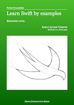

# Learn Swift by examples
This is a repository about my book entitled: *[Learn Swift by examples](https://fulmanski.pl/books/pl/index.php)*

You can download sample directly from my web page *[Learn Swift by examples](https://fulmanski.pl/books/pl/index.php)* or buy it on Apple Books (soon).

Current version is: *1.0, June 2021 (**early access**), build number 202106040022*.

Give this book a try, and please let me know what you think. Any feedback is very much encouraged and welcomed! If you think that my time is worth this effort, you can support what I’m doing now and help me finalize this project. Please use [email](mailto:book@fulmanski.pl) or [GitHub Issues](https://github.com/fulmanp/Learn-Swift-by-examples-beginner/issues) to give your positive or negative, but in all cases constructive, feedback.
